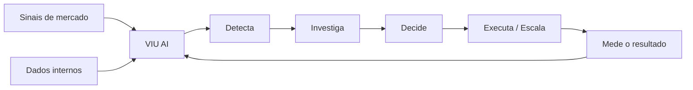

<div align="center">

# VIU AI

### Agente autônomo para inteligência, marketing e resposta ao mercado

**Percebe sinais. Investiga. Decide. Age. Mede. Aprende.**

🏆 **Projeto vencedor do Hack2L**, hackathon promovido pela **Liga Jovem da Unicamp** e pela **Canastra Ventures**.

</div>

---

## Sobre o projeto

Empresas já possuem dashboards, social listening, analytics, CRM e ferramentas de marketing. O problema é que essas informações continuam fragmentadas — e quase sempre ainda existe uma pessoa responsável por perceber o que mudou, investigar o motivo, decidir o que fazer e acompanhar o resultado.

A **VIU AI** nasceu para explorar uma ideia diferente: e se uma IA não apenas mostrasse o que está acontecendo, mas **assumisse responsabilidade por responder ao mercado dentro de limites definidos pela empresa?**

O protótipo demonstra um agente autônomo capaz de monitorar sinais internos e externos, detectar anomalias, investigar evidências, construir uma hipótese, avaliar urgência, acionar ferramentas, preparar uma decisão e acompanhar o que acontece depois.

> **Não é só um dashboard com IA. É um agente operando dentro da empresa.**

---

## O problema

O mercado se move rápido. Tendências aparecem, narrativas crescem, clientes mudam de comportamento e oportunidades podem durar poucas horas.

As ferramentas atuais ajudam a **ouvir**, **analisar** ou **executar**, mas essas etapas normalmente continuam separadas. A consequência é uma grande latência entre o primeiro sinal e a ação da empresa.

A VIU AI foi pensada para reduzir essa distância.

---

## Como a VIU AI funciona



O agente opera em um **closed loop**:

1. monitora sinais continuamente;
2. detecta uma mudança relevante;
3. escolhe autonomamente quais ferramentas e dados consultar;
4. cruza evidências externas com métricas internas;
5. constrói uma hipótese sem assumir causalidade indevida;
6. calcula confiança e urgência;
7. decide se pode agir ou se precisa escalar para humanos;
8. prepara a decisão e acompanha o follow-up;
9. volta a monitorar o resultado.

---

## O que o protótipo demonstra

### 🧠 Investigação autônoma

O agente usa **Open Agent Loops** para escolher quais ferramentas consultar durante uma investigação, sem seguir uma sequência rígida pré-programada. A inferência é feita por um modelo compatível com a API OpenAI via **Featherless AI**.

### 🌎 Inteligência externa

A arquitetura suporta busca de sinais públicos por meio da **Gorilla API**, com fontes como Reddit e X. Para garantir uma demo confiável durante o hackathon, o projeto também possui datasets e fallbacks simulados.

### 📊 Dados do negócio

O agente cruza os sinais externos com métricas internas para avaliar se uma mudança de mercado merece atenção e qual seu possível impacto.

### 🔎 Evidências, não apenas respostas

A interface expõe ações observáveis do agente — ferramentas chamadas, sinais encontrados, métricas consultadas, nível de confiança e evidências — sem expor raciocínio interno ou chain-of-thought.

### 🎙️ Decision Room com voz

Quando uma decisão humana é necessária, a VIU AI prepara uma **Decision Room**: apresenta a investigação, mostra as evidências e permite uma interação por voz com o agente. A camada de voz foi construída para integração com **ElevenLabs**.

### 🔁 Follow-up

Depois da decisão, o sistema registra ações e continua monitorando o resultado, aproximando o produto de um fluxo realmente autônomo e closed-loop.

---

## Fluxo da demo

Durante a demonstração, a VIU AI identifica uma anomalia, inicia a investigação automaticamente e começa a consultar suas ferramentas.

Ela encontra sinais relevantes, compara com métricas internas, agrupa evidências, calcula confiança e urgência e produz uma recomendação. Caso o cenário exija decisão humana, o agente abre a **Decision Room**, apresenta o caso por voz e registra a decisão tomada.

A partir daí, a VIU AI executa ou acompanha os próximos passos e retorna ao estado de monitoramento.

---

## Arquitetura

O projeto foi construído para separar a interface das integrações e do raciocínio do agente. Isso permite substituir mocks por serviços reais sem reconstruir a aplicação.

```text
UI / Dashboard
      │
      ▼
Service & Adapter Layer
      │
      ├── Market Signals
      ├── Business Metrics
      ├── Voice
      ├── Calendar / Decisions
      └── Follow-up Actions
      │
      ▼
Autonomous Agent
      │
      ├── Open Agent Loops
      ├── Featherless AI
      └── Tool execution
```

---

## Stack

**Frontend**

- React 19
- TypeScript
- TanStack Start + TanStack Router
- Tailwind CSS
- Radix UI
- Recharts

**IA e agentes**

- Open Agent Loops
- Featherless AI / API OpenAI-compatible
- Zod para validação estruturada

**Integrações**

- Gorilla API para inteligência de mercado
- ElevenLabs para experiência de voz
- Camada de adapters preparada para dados internos, calendário e ações

---

## Rodando localmente

### Pré-requisitos

- Node.js 20+
- npm

### Instalação

```bash
git clone https://github.com/ThallesCansi/viu-ai.git
cd viu-ai
npm install
npm run dev
```

O Vite iniciará o ambiente local de desenvolvimento.

### Variáveis de ambiente

O protótipo consegue operar parcialmente com dados simulados. Para habilitar as integrações reais, configure as variáveis necessárias em um arquivo `.env.local`:

```env
# Agent / LLM
FEATHERLESS_API_KEY=
FEATHERLESS_MODEL=Qwen/Qwen3-32B

# Market intelligence
GORILLA_API_KEY=
VITE_USE_MOCK_MARKET_SIGNALS=false

# Voice
ELEVENLABS_API_KEY=
VITE_ELEVENLABS_AGENT_ID=
```

Há outras configurações opcionais de timeout, fontes e endpoints disponíveis no código.

---

## Scripts

```bash
npm run dev        # desenvolvimento
npm run build      # build de produção
npm run preview    # preview do build
npm run test       # testes
npm run lint       # lint
npm run typecheck  # verificação TypeScript
```

---

## Visão

A versão criada no Hack2L explora **Market Intelligence** e tomada de decisão. A visão da VIU AI é evoluir para um **gestor autônomo de resposta ao mercado**, capaz de operar principalmente em dois modos:

**Growth** — identificar tendências e oportunidades, criar experimentos de marketing, medir resultados e otimizar ações.

**Risk** — detectar mudanças de percepção, narrativas negativas e riscos reputacionais, responder dentro de limites pré-definidos e escalar apenas decisões sensíveis.

A empresa define objetivos, identidade, orçamento e limites de autonomia. A VIU AI trabalha dentro desse mandato.

---

## Hack2L

A VIU AI foi concebida e prototipada durante o **Hack2L**, promovido pela **Liga Jovem da Unicamp** e pela **Canastra Ventures**.

O desafio era demonstrar uma aplicação de IA verdadeiramente **autônoma e closed-loop**. Em vez de construir mais um copiloto que espera comandos, buscamos criar a experiência de um agente que observa o ambiente, toma iniciativa, usa ferramentas e conduz um processo até uma decisão.

🏆 **A VIU AI foi o projeto vencedor do hackathon.**

---

<div align="center">

### VIU AI

**Do sinal à ação.**

</div>
